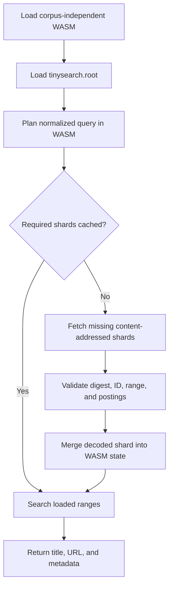

# Sharded indexes

TinySearch's exact backend can be emitted as a small root plus immutable lexical
shards. The browser loads the root once, asks the WASM engine which shards a
query needs, and fetches only those shards before searching.

This design keeps network orchestration in JavaScript and compact decoding and
ranking in WebAssembly.

## Goals

- Preserve the exact backend's existing ranking and prefix semantics.
- Keep the WASM engine independent of corpus size.
- Avoid downloading unrelated posting lists.
- Make shard requests cacheable across deployments.
- Deduplicate concurrent requests and allow failed requests to be retried.
- Keep the monolithic exact v2 and legacy Xor8 formats readable.
- Reject malformed, mismatched, or corrupt artifacts before searching them.

## Artifact set

An exact WASM build emits:

```text
tinysearch_engine.wasm
tinysearch_engine.js
tinysearch.root
<sha256>.tinysearch-shard
<sha256>.tinysearch-shard
...
```

`tinysearch.root` contains:

- the root format version;
- result metadata (`PostId` records);
- ordered lexical ranges;
- each shard's numeric ID, byte length, SHA-256 digest, and filename.

Each shard contains a contiguous range of normalized terms and their posting
lists. Posting lists continue to use global dense document IDs with delta and
varint encoding.

The shard filename is the full lowercase SHA-256 digest of its encoded bytes.
Unchanged shards therefore retain the same URL between builds. The CLI and
high-level `TinySearch` API sort documents by URL, title, and metadata before
assigning IDs, so their artifact generation is deterministic even when input
arrived through a `HashMap`. Direct `ExactIndexBackend` callers retain their
supplied document order, which controls equal-score ordering and artifact IDs.

## Query lifecycle



The loader stores one in-flight promise per shard URL. Concurrent searches that
need the same shard share that request. Failed promises are removed so a later
search can retry. Loaded shard URLs remain cached by the loader and decoded
shards remain in WASM memory for the engine's lifetime.

The engine does not retain a second copy of each encoded shard after decoding;
it keeps only decoded terms/postings and the digest needed for idempotence.

## Prefix routing

Vocabulary ranges are sorted lexically.

- Query terms shorter than `MIN_PREFIX_LEN` route to the single range that could
  contain the exact term.
- Longer query terms route to every range that can contain a completion of that
  prefix.
- Multi-term queries use the sorted, deduplicated union of those shard IDs.

Routing is deliberately conservative at shard boundaries. It may fetch a shard
whose lexical range contains a gap, but it cannot omit a possible completion.

Search still applies the existing scoring model for every query-token
occurrence:

| Match | Score |
| --- | ---: |
| Exact title token | 3 |
| Title prefix of at least three characters | 2 |
| Any matching content completion | 1 |

A document receives at most one content point per query token, even if several
matching terms live in different shards. Multi-term queries remain additive OR
queries, and equal scores retain global document order.

## Building

The default raw shard target is 64 KiB:

```sh
tinysearch --release -m wasm -p wasm_output index.json
```

Use `--shard-size` to tune the raw target:

```sh
tinysearch --release --shard-size 32768 -m wasm -p wasm_output index.json
```

Partitioning uses estimated encoded byte weight, not term count. A single term
and its posting list are never split, so an oversized singleton shard may exceed
the target.

The CLI reports WASM, root, total shard, and maximum shard sizes after each
build. Very small shard targets increase root descriptor size and HTTP request
count; they exist mainly for stress testing. Start with 64 KiB and adjust using
real compressed transfer and latency measurements.

## JavaScript API

```js
import { initTinysearch } from './tinysearch_engine.js';

const engine = await initTinysearch();
const results = await engine.search('rust wasm', 10);
```

Custom deployment locations are supported:

```js
const engine = await initTinysearch({
  wasmUrl: new URL('/search/tinysearch_engine.wasm', location.origin),
  rootUrl: new URL('/search/tinysearch.root', location.origin),
  shardBaseUrl: new URL('/search/', location.origin),
});
```

The loader also exposes:

- `plan(query)` to inspect required shards without fetching;
- `preload(query)` to fetch and decode required shards;
- `search(query, limit)` to preload and search;
- `loadedUrls` and `stats` for observability;
- `attachTypeahead(input, render, options)` for stale-safe async input handling.

The loader resolves default asset URLs relative to its own ES module URL, uses
`WebAssembly.instantiateStreaming` when possible, and falls back to
`WebAssembly.instantiate` without downloading the WASM a second time.

## WASM ABI

The generated engine uses a small versioned raw ABI. Inputs are pointer/length
pairs allocated through `engine_alloc` and released through `engine_dealloc`.
Outputs use opaque handles with pointer, length, and free operations.

This avoids null-terminated strings, guessed allocator exports, fixed scratch
addresses, and the previous behavior of growing linear memory for every query.
The integration suite performs hundreds of warmed searches and verifies that
memory does not grow one page per request.

## HTTP caching and deployment

Recommended headers:

- `tinysearch.root`: revalidate (`Cache-Control: no-cache`) or use a short TTL;
- WASM and content-addressed shards: `Cache-Control: public, max-age=31536000, immutable`;
- `tinysearch_engine.js`: version or content-address it in the surrounding site build.

Upload new shards and WASM before publishing the new root. Retain old
content-addressed shards long enough for clients that still hold an older root.
Do not overwrite a content-addressed shard with different bytes.

Serve the WASM as `application/wasm`. Shards and the root may use
`application/octet-stream`. Standard HTTP Brotli or gzip compression is
recommended.

## Test strategy

The feature has three layers of tests:

1. Native differential tests compare monolithic and fully loaded sharded results
   for every complete term, every Unicode-safe prefix, punctuation, short terms,
   repeated terms, multi-term queries, and multiple result limits.
2. Wire tests cover malformed roots/shards, IDs, lengths, digests, posting lists,
   duplicates, and trailing bytes.
3. The generated-artifact integration test compiles the actual WASM, imports the
   emitted ES module under Node, injects a file-backed `fetch`, and verifies lazy
   loading, strict-subset requests, request deduplication, retry behavior,
   Unicode, result shape, MIME fallback, and bounded memory growth.

## Initial fixture measurements

Using `fixtures/index.json`, a release build with `wasm-opt -Oz`, and the
default 64 KiB target:

| Artifact | Raw | gzip -9 | Brotli 11 |
| --- | ---: | ---: | ---: |
| WASM engine | 100,623 B | 46,604 B | 39,400 B |
| ES module loader | 16,364 B | 4,394 B | 3,808 B |
| Root | 5,179 B | 2,376 B | 2,001 B |
| Larger shard | 65,528 B | 35,787 B | 31,307 B |
| Smaller shard | 12,003 B | 6,986 B | 6,026 B |

The first query generally needs one shard, so the measured Brotli cold payload
for a query routed to the larger shard is about 76.5 KiB rather than the complete
index. In the Node integration run, 250 warmed searches averaged 0.065 ms each
and added zero WASM memory bytes. These numbers are a baseline, not a permanent
budget; changes should report the same measurements and investigate material
regressions.

## Current scope

Query-selective sharding is implemented for the exact backend. Xor8 remains on
its legacy embedded WASM path because its per-document filters must all be
scanned for an arbitrary query and do not benefit from lexical routing.

The current root keeps result metadata so searches can return complete results
without a second metadata waterfall. If metadata becomes the dominant root cost
for very large corpora, document-range metadata shards are the next compatible
extension to the format.
